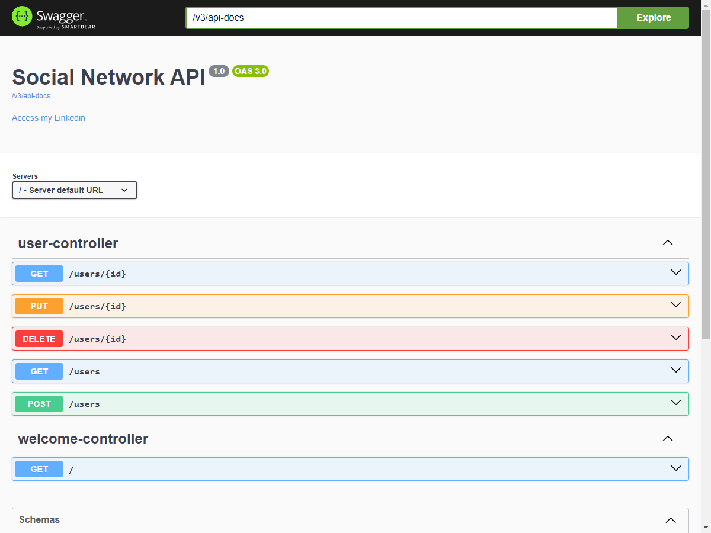

# Spring Boot
## Projeto: Social Network API

### Sobre o Projeto

O projeto é uma API desenvolvida com Spring Boot, utilizando métodos HTTP e dividida em camadas. A persistência de dados é feita com Spring Data JPA e um banco de dados H2 em memória. A documentação e a interação com a API são facilitadas pelo SpringDoc e OpenAPI/Swagger. A implementação segue os princípios de Orientação a Objetos.

##### About the project

The project is an API developed with Spring Boot, using HTTP methods and divided into layers. Data persistence is done with Spring Data JPA and an in-memory H2 database. Documentation and interaction with the API is facilitated by SpringDoc and OpenAPI/Swagger. The implementation follows Object Orientation principles.

### Diagrama de Classe
##### Class Diagram

")

### Formato JSON
##### JSON Format
<pre>
{
    "photo": "string",
    "nome": "string",
    "id": 0,
    "profile": {
      "biography": "string",
      "numberFollowers": 0
    },
    "friends": [
      {
        "photo": "string",
        "nome": "string",
        "id": 0,
        "comments": [
          {
            "title": "string",
            "description": "string",
            "image": "string",
            "id": 0
          }
        ]
      }
    ],
    "followers": [
      {
        "comments": [
          {
            "title": "string",
            "description": "string",
            "image": "string",
            "id": 0
          }
        ],
        "id": 0
      }
    ],
    "publishs": [
      {
        "title": "string",
        "description": "string",
        "image": "string",
        "id": 0
      }
    ],
    "comments": [
      {
        "title": "string",
        "description": "string",
        "image": "string",
        "id": 0
      }
    ]
  }
</pre>

### Ferramentas Utilizadas
##### Tools Used

<table>
    <head>
        <tr><th>IDE</th><th>Versão</tr>
    </head>
    <body>
        <tr><td>Eclipse</td><td>2024-03 (4.31.0)</td></tr>        
    </body>
</table>

### Tecnologias Utilizadas
##### Technologies Used

 <table>
    <head>
        <tr><th>Tecnologia</th><th>Descrição</th></tr>
    </head>
    <body>
        <tr>
            <td>JDK</td>
            <td>Java 17</td>
        </tr>
        <tr>
            <td>Paradgma</td>
            <td>Orientação a Objetos</td>
        </tr>        
        <tr>
            <td>Framework</td>
            <td>Spring Boot / Maven</td>
        </tr>
        <tr>
            <td>Documentação</td>
            <td>OpenAPI / Swagger / Spring Doc</td>
        </tr>
        <tr>
            <td>Spring Data</td>
            <td>JPA</td>
        </tr>
        <tr>
            <td>Banco de Dados</td>
            <td>H2 - Memória</td>
        </tr>
    </body>
</table>

### Organização do Projeto
##### Project Organization

")

### Acesso da API com Swagger
##### API Access with Swagger

http://localhost:8080/swagger-ui/index.html

### Autor (Author)
#### Katarine Albuquerque
###### Desenvolvedora Front-end (Developer)
   
